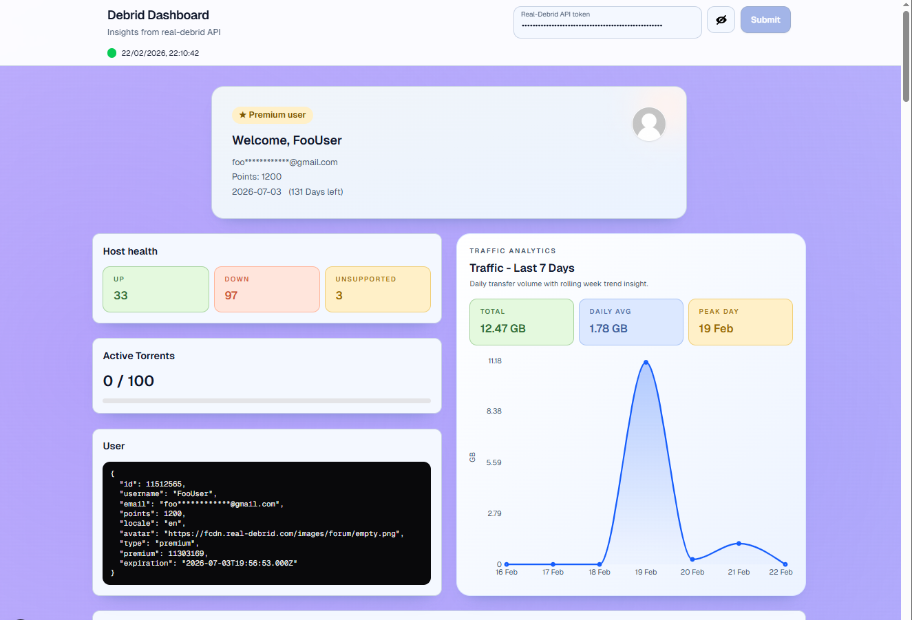

# Debrid Dashboard

A simple Next.js app that displays Real-Debrid account information for a given API token.



## Purpose

The purpose of this project is to let you paste a Real-Debrid API token and view useful account data (user details, traffic, downloads, torrents, hosts, and related actions) in one dashboard.

## What It Shows

- User summary and account metadata
- Traffic usage insights
- Downloads and torrents tables
- Host and host-status information
- Basic account actions (for example, token disable / avatar reset where available)

## Token Safety

- The token is stored in browser `sessionStorage` (not in the repository).
- The token is never committed to source control by this app.
- It is only used to make authenticated requests for your Real-Debrid data.
- Because it uses `sessionStorage`, it is scoped to your current browser session.
- Closing the browser/tab clears `sessionStorage` in typical usage.
- No database or backend token storage is used by this project.

### Recommended Safety Practices

- Use your token only on devices you trust.
- Do not share screenshots that include your token.
- If you suspect exposure, rotate/disable the token from Real-Debrid immediately.
- Prefer using the app over `https` (the hosted Vercel deployment uses HTTPS).

## Run Locally

```bash
1. Install dependencies:


npm install

2. Start the dev server:

npm run dev

3. Open:

http://localhost:3000

4. Paste your Real-Debrid API token into the header input and submit to load data.
```

## Tech Stack

- Next.js (App Router)
- React + TypeScript
- Tailwind CSS
- TanStack Query + TanStack Table

## Hosted App

https://debrid-client-theta.vercel.app/
